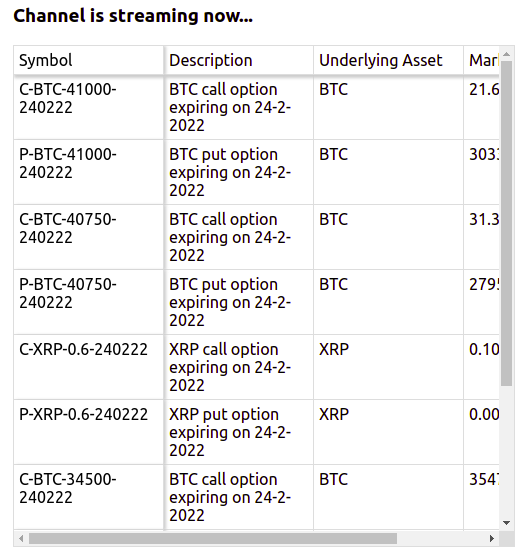

# Populating Table using API response and WebSocket stream

Here we get the first 3 columns from API and last 1 column from WebSocket.

## Libraries

- [axios](https://www.npmjs.com/package/axios) for API request.
- [react-table](https://www.npmjs.com/package/react-table) for table utilities.
- [react-table-sticky](https://www.npmjs.com/package/react-table-sticky) and [styled-components](https://www.npmjs.com/package/styled-components) to make the first column and header sticky.

